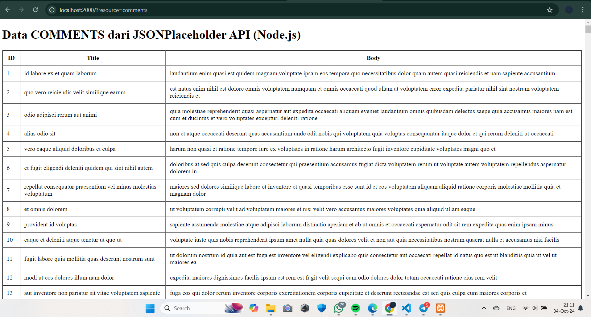

Hasil dari mengambil dan menampilkan data dari API JSONPlaceholder menggunakan PHP

Hasil dari mengambil dan menampilkan data dari API JSONPlaceholder menggunakan JS

Hasil modifikasi implementasi Node.js untuk mengambil data dari resource lain memakai '/comments', dengan cara mengubah route browsernya menjadi localhost:1000/?resource=comments

Hasil modifikasi implementasi Node.js untuk mengambil data dari resource lain memakai '/users', dengan cara mengubah route browsernya menjadi localhost:1000/?resource=users 

Menambahkan fitur filter title

Menambahkan fitur filter id
